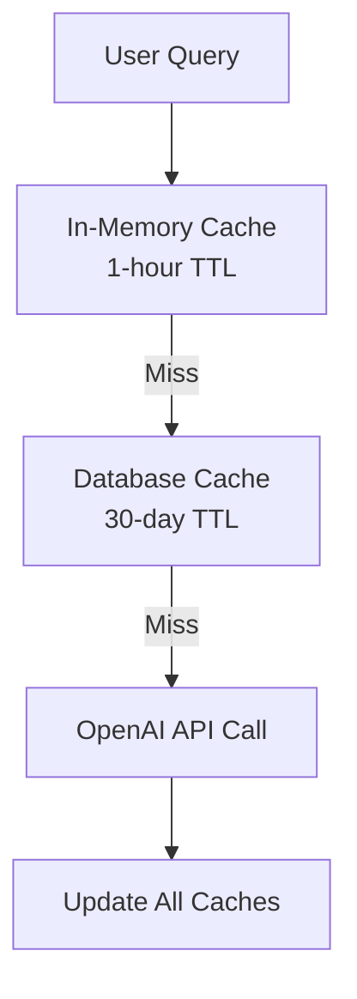
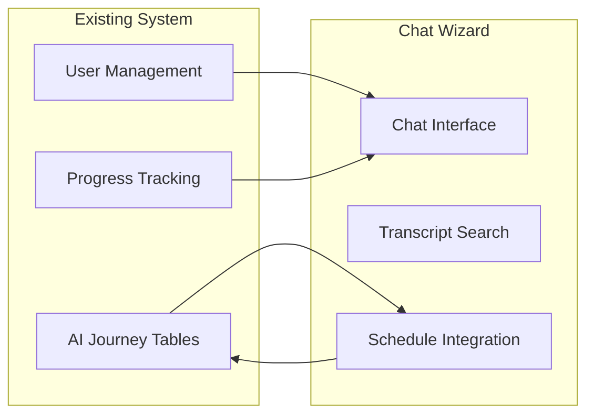

# Chat Wizard FAQ & Troubleshooting Guide
## Common Issues, Solutions, and Best Practices

---

## Table of Contents
1. [Frequently Asked Questions](#frequently-asked-questions)
2. [Common Issues & Solutions](#common-issues--solutions)
3. [Performance Troubleshooting](#performance-troubleshooting)
4. [Database Issues](#database-issues)
5. [API Integration Problems](#api-integration-problems)
6. [Development Environment Setup](#development-environment-setup)
7. [Deployment Issues](#deployment-issues)
8. [Monitoring & Debugging](#monitoring--debugging)

---

## Frequently Asked Questions

### General System Questions

#### Q: What makes Chat Wizard different from a regular chatbot?

**A:** Chat Wizard is specifically designed for learning with these unique features:
- **Multi-Video Search**: Searches across ALL video transcripts simultaneously, not just one
- **Learning Context**: Understands curriculum progression and user learning level
- **Calendar Integration**: Can schedule videos and create learning paths
- **Smart Caching**: Reduces costs by caching common educational questions
- **Citation System**: Always provides timestamps and video references for answers

#### Q: Why not use N8n workflows for this system?

**A:** After analysis, N8n was removed because:
- No need for Discord bot automation (main N8n use case)
- Content health checks aren't a priority
- Direct Next.js implementation provides better control and performance
- Reduces system complexity and maintenance overhead
- Eliminates another external dependency

#### Q: How does the smart caching work to reduce API costs?

**A:** The caching system works in three layers:



1. **In-Memory Cache**: Stores hot questions for 1 hour
2. **Database Cache**: Stores the 50 most common questions for 30 days
3. **Semantic Matching**: Uses embeddings to match similar questions
4. **Auto-Learning**: System learns new common patterns over time

**Cost Impact**: Typically reduces OpenAI API calls by 60-80% after the system learns common patterns.

### Technical Architecture Questions

#### Q: How do you handle large video transcripts without performance issues?

**A:** We use a multi-layered approach:

1. **Chunking Strategy**: Split transcripts into 500-token chunks with 100-token overlap
2. **Vector Indexing**: Use pgvector with optimized indexes for fast similarity search
3. **Result Ranking**: Return only the most relevant chunks, not entire transcripts
4. **Lazy Loading**: Process transcripts on-demand rather than all at once

#### Q: What happens if a video transcript isn't available?

**A:** The system gracefully handles missing transcripts:

```typescript
// Fallback hierarchy
1. Try to fetch official transcript from YouTube
2. Fall back to auto-generated transcript
3. Use video description if available
4. Mark as "transcript unavailable" and continue
5. Show video in search results but note transcript limitation
```

#### Q: How do you ensure answer quality and prevent hallucinations?

**A:** Multiple quality control measures:

1. **Context-Grounded Responses**: AI only uses provided transcript chunks, not general knowledge
2. **Confidence Scoring**: Each answer includes a confidence score (0-1)
3. **Citation Requirements**: Every answer must cite specific video timestamps
4. **Content Filtering**: Educational content focus with inappropriate content filtering
5. **Human Review**: Flagging system for reviewing questionable responses

### Integration Questions

#### Q: How does this integrate with the existing AI Journey system?

**A:** Chat Wizard extends the existing system:



- **Schedule Integration**: Creates entries in `ai_journey_schedule` table
- **Progress Tracking**: Updates completion status in existing progress system
- **User Context**: Uses existing user preferences and learning level
- **Conversation History**: Stores chat in `ai_journey_chat` table

#### Q: Can users still use the system if they don't want calendar features?

**A:** Yes, the system is modular:

- **Core Chat**: Always available - AI answers with video references
- **Search**: Users can search videos without scheduling
- **Calendar**: Optional - users can ignore scheduling suggestions
- **Recommendations**: Passive - doesn't interfere with manual learning paths

---

## Common Issues & Solutions

### Issue: "Vector search returns no results"

**Symptoms:**
- Chat responses don't include video references
- Search endpoint returns empty results
- Users get generic answers without citations

**Diagnosis Steps:**
```sql
-- Check if embeddings exist
SELECT COUNT(*) FROM transcript_chunks WHERE embedding IS NOT NULL;

-- Check embedding dimensions
SELECT 
  id, 
  array_length(embedding, 1) as dimensions 
FROM transcript_chunks 
WHERE embedding IS NOT NULL 
LIMIT 5;

-- Test basic similarity search
SELECT 
  chunk_text,
  1 - (embedding <=> '[0.1,0.2,0.3,...]'::vector) as similarity
FROM transcript_chunks
WHERE embedding IS NOT NULL
LIMIT 5;
```

**Common Causes & Solutions:**

1. **pgvector Extension Not Installed**
```sql
-- Solution: Install pgvector in Supabase
CREATE EXTENSION IF NOT EXISTS vector;
```

2. **Missing Vector Index**
```sql
-- Solution: Create proper vector index
CREATE INDEX CONCURRENTLY transcript_chunks_embedding_idx 
ON transcript_chunks USING ivfflat (embedding vector_cosine_ops)
WITH (lists = 100);
```

3. **Embedding Dimension Mismatch**
```typescript
// Problem: Wrong embedding model or dimensions
const embedding = await openai.embeddings.create({
  model: 'text-embedding-ada-002', // Must use ada-002
  input: text
})

// Solution: Verify dimension is 1536
console.log('Embedding dimensions:', embedding.data[0].embedding.length)
```

4. **RPC Function Missing**
```sql
-- Solution: Create the similarity search function
CREATE OR REPLACE FUNCTION match_transcript_chunks(
  query_embedding vector(1536),
  match_threshold float DEFAULT 0.7,
  match_count int DEFAULT 10
)
RETURNS TABLE (
  chunk_id uuid,
  content text,
  similarity float,
  video_title text,
  timestamp text
)
LANGUAGE plpgsql
AS $$
BEGIN
  RETURN QUERY
  SELECT
    tc.id,
    tc.chunk_text,
    1 - (tc.embedding <=> query_embedding) AS similarity,
    vt.title,
    tc.start_timestamp
  FROM transcript_chunks tc
  JOIN video_transcripts vt ON tc.transcript_id = vt.id
  WHERE 1 - (tc.embedding <=> query_embedding) > match_threshold
  ORDER BY tc.embedding <=> query_embedding
  LIMIT match_count;
END;
$$;
```

### Issue: "Chat API returns 500 errors intermittently"

**Symptoms:**
- Random 500 errors during chat requests
- Works sometimes, fails other times
- Error logs show various failure points

**Diagnosis Steps:**
```bash
# Check API logs
tail -f /var/log/nextjs/app.log | grep ERROR

# Test with minimal request
curl -X POST http://localhost:3000/api/chat/blox-wizard \
  -H "Content-Type: application/json" \
  -d '{"message":"test","sessionId":"test"}'

# Check database connectivity
psql $DATABASE_URL -c "SELECT 1"
```

**Common Causes & Solutions:**

1. **Database Connection Pool Exhaustion**
```typescript
// Problem: Too many concurrent connections
// Solution: Implement connection pooling
import { Pool } from 'pg'

const pool = new Pool({
  connectionString: process.env.DATABASE_URL,
  max: 20,
  idleTimeoutMillis: 30000,
  connectionTimeoutMillis: 2000,
})
```

2. **OpenAI Rate Limiting**
```typescript
// Problem: Hitting rate limits without proper handling
// Solution: Implement exponential backoff
async function callOpenAIWithRetry(operation, maxRetries = 3) {
  for (let attempt = 1; attempt <= maxRetries; attempt++) {
    try {
      return await operation()
    } catch (error) {
      if (error?.code === 'rate_limit_exceeded' && attempt < maxRetries) {
        const delay = Math.pow(2, attempt) * 1000
        await new Promise(resolve => setTimeout(resolve, delay))
        continue
      }
      throw error
    }
  }
}
```

3. **Memory Leaks in Embedding Cache**
```typescript
// Problem: Memory grows unbounded
// Solution: Implement proper cache eviction
class BoundedCache {
  private cache = new Map()
  private maxSize = 1000

  set(key, value) {
    if (this.cache.size >= this.maxSize) {
      // Remove oldest entries
      const firstKey = this.cache.keys().next().value
      this.cache.delete(firstKey)
    }
    this.cache.set(key, value)
  }
}
```

### Issue: "Transcript processing fails for most videos"

**Symptoms:**
- `/api/transcripts/process` returns mostly failed videos
- Error messages about unavailable transcripts
- Processing takes very long or times out

**Diagnosis Steps:**
```bash
# Test YouTube API directly
curl "https://www.googleapis.com/youtube/v3/captions?part=snippet&videoId=VIDEO_ID&key=YOUR_API_KEY"

# Check video IDs format
node -e "
const curriculum = require('./src/data/curriculum.json')
const videos = curriculum.modules[0].weeks[0].days[0].videos
console.log('Sample video:', videos[0])
"
```

**Common Causes & Solutions:**

1. **YouTube API Key Issues**
```typescript
// Problem: Invalid or expired API key
// Solution: Verify API key and quotas
const youtube = google.youtube({
  version: 'v3',
  auth: process.env.YOUTUBE_API_KEY
})

// Test API key
try {
  const response = await youtube.videos.list({
    part: 'snippet',
    id: 'test-video-id'
  })
  console.log('API key working:', response.data)
} catch (error) {
  console.error('API key error:', error.message)
}
```

2. **Transcripts Not Available**
```typescript
// Problem: Many videos don't have transcripts
// Solution: Implement graceful fallback
async function getTranscript(videoId) {
  try {
    // Try official transcript first
    const transcript = await getOfficialTranscript(videoId)
    return transcript
  } catch (error) {
    try {
      // Fall back to auto-generated
      const autoTranscript = await getAutoTranscript(videoId)
      return autoTranscript
    } catch (error) {
      // Log and continue with other videos
      console.warn(`No transcript available for ${videoId}`)
      return null
    }
  }
}
```

3. **Processing Timeout**
```typescript
// Problem: Processing all videos at once
// Solution: Batch processing with limits
async function processVideosInBatches(videoIds, batchSize = 5) {
  const results = []
  
  for (let i = 0; i < videoIds.length; i += batchSize) {
    const batch = videoIds.slice(i, i + batchSize)
    
    const batchResults = await Promise.allSettled(
      batch.map(id => processVideo(id))
    )
    
    results.push(...batchResults)
    
    // Add delay between batches to avoid rate limits
    await new Promise(resolve => setTimeout(resolve, 1000))
  }
  
  return results
}
```

---

## Performance Troubleshooting

### Slow API Response Times

**Target Performance:**
- Chat API: < 3 seconds
- Vector Search: < 500ms
- Transcript Processing: < 2 seconds per video

**Diagnosis Tools:**

```typescript
// Add performance monitoring to API routes
export async function POST(request) {
  const startTime = Date.now()
  
  try {
    // Your API logic here
    const result = await processRequest(request)
    
    const duration = Date.now() - startTime
    console.log(`API call completed in ${duration}ms`)
    
    if (duration > 3000) {
      console.warn(`Slow API call detected: ${duration}ms`)
    }
    
    return NextResponse.json(result)
  } catch (error) {
    console.error(`API error after ${Date.now() - startTime}ms:`, error)
    throw error
  }
}
```

**Common Performance Issues:**

1. **Unoptimized Database Queries**
```sql
-- Problem: Full table scans
EXPLAIN ANALYZE 
SELECT * FROM transcript_chunks 
WHERE chunk_text ILIKE '%search term%';

-- Solution: Proper indexing and query optimization
EXPLAIN ANALYZE 
SELECT tc.chunk_text, vt.title 
FROM transcript_chunks tc
JOIN video_transcripts vt ON tc.transcript_id = vt.id
WHERE tc.embedding <=> $1 < 0.3
ORDER BY tc.embedding <=> $1
LIMIT 10;
```

2. **N+1 Query Problems**
```typescript
// Problem: Multiple separate queries
for (const chunk of chunks) {
  const video = await getVideo(chunk.transcript_id) // N+1 problem
}

// Solution: Single query with JOIN
const chunksWithVideos = await supabase
  .from('transcript_chunks')
  .select(`
    *,
    video_transcripts (
      title,
      youtube_id
    )
  `)
  .in('id', chunkIds)
```

3. **Large Embedding Computations**
```typescript
// Problem: Computing embeddings synchronously
const embeddings = await Promise.all(
  chunks.map(chunk => generateEmbedding(chunk.text))
)

// Solution: Batch processing
const embeddings = []
for (let i = 0; i < chunks.length; i += 10) {
  const batch = chunks.slice(i, i + 10)
  const batchEmbeddings = await openai.embeddings.create({
    model: 'text-embedding-ada-002',
    input: batch.map(c => c.text)
  })
  embeddings.push(...batchEmbeddings.data.map(e => e.embedding))
}
```

### Memory Usage Issues

**Monitoring Memory:**
```typescript
// Add memory monitoring
setInterval(() => {
  const usage = process.memoryUsage()
  console.log('Memory usage:', {
    rss: Math.round(usage.rss / 1024 / 1024) + 'MB',
    heapTotal: Math.round(usage.heapTotal / 1024 / 1024) + 'MB',
    heapUsed: Math.round(usage.heapUsed / 1024 / 1024) + 'MB',
    external: Math.round(usage.external / 1024 / 1024) + 'MB'
  })
}, 30000)
```

**Common Memory Issues:**

1. **Unbounded Caches**
```typescript
// Problem: Cache grows indefinitely
class MemoryCache {
  private cache = new Map()
  
  set(key, value) {
    this.cache.set(key, value) // No size limit!
  }
}

// Solution: LRU cache with size limit
class LRUCache {
  private cache = new Map()
  private maxSize = 1000
  
  set(key, value) {
    if (this.cache.has(key)) {
      this.cache.delete(key)
    } else if (this.cache.size >= this.maxSize) {
      const firstKey = this.cache.keys().next().value
      this.cache.delete(firstKey)
    }
    this.cache.set(key, value)
  }
}
```

2. **Large Objects in Memory**
```typescript
// Problem: Keeping full transcripts in memory
const fullTranscripts = await loadAllTranscripts() // Memory intensive!

// Solution: Stream and process
async function* streamTranscripts() {
  const transcripts = await getTranscriptIds()
  for (const id of transcripts) {
    yield await getTranscript(id)
  }
}

for await (const transcript of streamTranscripts()) {
  await processTranscript(transcript)
  // transcript is garbage collected after processing
}
```

---

## Database Issues

### Connection Problems

**Common Connection Errors:**
```
Error: Connection terminated unexpectedly
Error: too many clients already
Error: server closed the connection unexpectedly
```

**Solutions:**

1. **Connection Pooling**
```typescript
import { Pool } from 'pg'

const pool = new Pool({
  host: 'localhost',
  port: 5432,
  database: 'your_db',
  user: 'your_user',
  password: 'your_password',
  max: 20, // Maximum number of clients
  idleTimeoutMillis: 30000,
  connectionTimeoutMillis: 2000,
})

// Ensure connections are properly released
export async function queryDatabase(query, params) {
  const client = await pool.connect()
  try {
    const result = await client.query(query, params)
    return result
  } finally {
    client.release() // Always release connection
  }
}
```

2. **Supabase Connection Limits**
```typescript
// For Supabase, use their client properly
import { createClient } from '@supabase/supabase-js'

const supabase = createClient(
  process.env.SUPABASE_URL,
  process.env.SUPABASE_ANON_KEY,
  {
    db: {
      schema: 'public',
    },
    auth: {
      persistSession: false, // For server-side usage
    },
  }
)
```

### Vector Database Issues

**pgvector Common Problems:**

1. **Extension Not Installed**
```sql
-- Check if pgvector is installed
SELECT * FROM pg_extension WHERE extname = 'vector';

-- Install if missing (requires superuser privileges)
CREATE EXTENSION IF NOT EXISTS vector;
```

2. **Index Not Created**
```sql
-- Check existing indexes
\d transcript_chunks

-- Create vector index if missing
CREATE INDEX CONCURRENTLY transcript_chunks_embedding_idx 
ON transcript_chunks USING ivfflat (embedding vector_cosine_ops)
WITH (lists = 100);
```

3. **Wrong Distance Function**
```sql
-- Wrong: Using L2 distance for similarity
SELECT chunk_text, embedding <-> $1 as distance
FROM transcript_chunks
ORDER BY embedding <-> $1;

-- Correct: Using cosine similarity
SELECT chunk_text, 1 - (embedding <=> $1) as similarity
FROM transcript_chunks
WHERE 1 - (embedding <=> $1) > 0.7
ORDER BY embedding <=> $1;
```

### Data Consistency Issues

**Orphaned Records:**
```sql
-- Find transcript chunks without parent transcripts
SELECT tc.id, tc.chunk_text
FROM transcript_chunks tc
LEFT JOIN video_transcripts vt ON tc.transcript_id = vt.id
WHERE vt.id IS NULL;

-- Clean up orphaned records
DELETE FROM transcript_chunks
WHERE transcript_id NOT IN (
  SELECT id FROM video_transcripts
);
```

**Duplicate Embeddings:**
```sql
-- Find duplicate embeddings (shouldn't happen)
SELECT embedding, COUNT(*)
FROM transcript_chunks
GROUP BY embedding
HAVING COUNT(*) > 1;
```

---

## API Integration Problems

### Authentication Issues

**Common Auth Problems:**

1. **JWT Token Expired**
```typescript
// Check token expiration
import jwt from 'jsonwebtoken'

function isTokenExpired(token) {
  try {
    const decoded = jwt.decode(token)
    return Date.now() >= decoded.exp * 1000
  } catch {
    return true
  }
}

// Auto-refresh tokens
async function makeAuthenticatedRequest(url, options = {}) {
  let token = getStoredToken()
  
  if (isTokenExpired(token)) {
    token = await refreshToken()
    storeToken(token)
  }
  
  return fetch(url, {
    ...options,
    headers: {
      ...options.headers,
      Authorization: `Bearer ${token}`
    }
  })
}
```

2. **Row Level Security Issues**
```sql
-- Check RLS policies
SELECT * FROM pg_policies WHERE tablename = 'transcript_chunks';

-- Test policy with specific user
SET ROLE authenticated;
SET request.jwt.claim.sub = 'user-id-here';
SELECT * FROM transcript_chunks LIMIT 1;
```

### Rate Limiting Problems

**Handling Rate Limits:**
```typescript
class RateLimitedClient {
  private requestQueue = []
  private processing = false
  
  async makeRequest(request) {
    return new Promise((resolve, reject) => {
      this.requestQueue.push({ request, resolve, reject })
      this.processQueue()
    })
  }
  
  private async processQueue() {
    if (this.processing) return
    this.processing = true
    
    while (this.requestQueue.length > 0) {
      const { request, resolve, reject } = this.requestQueue.shift()
      
      try {
        const response = await fetch(request.url, request.options)
        
        if (response.status === 429) {
          const retryAfter = response.headers.get('Retry-After') || 60
          console.log(`Rate limited, waiting ${retryAfter}s`)
          await new Promise(r => setTimeout(r, retryAfter * 1000))
          
          // Retry the request
          this.requestQueue.unshift({ request, resolve, reject })
          continue
        }
        
        resolve(await response.json())
      } catch (error) {
        reject(error)
      }
      
      // Add small delay between requests
      await new Promise(r => setTimeout(r, 100))
    }
    
    this.processing = false
  }
}
```

---

## Development Environment Setup

### Common Setup Issues

**Node.js Version Problems:**
```bash
# Check Node.js version
node --version

# Should be 18+ for proper ES modules support
# Use nvm to manage versions
nvm install 18
nvm use 18
```

**Environment Variables:**
```bash
# Create .env.local with all required variables
cp .env.example .env.local

# Verify all environment variables are set
node -e "
const required = [
  'NEXT_PUBLIC_SUPABASE_URL',
  'NEXT_PUBLIC_SUPABASE_ANON_KEY', 
  'SUPABASE_SERVICE_ROLE_KEY',
  'OPENAI_API_KEY'
]

const missing = required.filter(key => !process.env[key])
if (missing.length > 0) {
  console.error('Missing environment variables:', missing)
  process.exit(1)
} else {
  console.log('All environment variables set')
}
"
```

**Database Setup Issues:**
```bash
# Test Supabase connection
npx supabase status

# Reset database if needed
npx supabase db reset

# Apply migrations
npx supabase db push
```

### IDE Configuration

**VS Code Settings:**
```json
// .vscode/settings.json
{
  "typescript.preferences.importModuleSpecifier": "relative",
  "editor.formatOnSave": true,
  "editor.codeActionsOnSave": {
    "source.organizeImports": true
  },
  "typescript.suggest.autoImports": true,
  "typescript.updateImportsOnFileMove.enabled": "always"
}
```

**Recommended Extensions:**
- TypeScript and JavaScript Language Features
- ES7+ React/Redux/React-Native snippets
- Prettier - Code formatter
- ESLint
- Tailwind CSS IntelliSense

---

## Deployment Issues

### Vercel Deployment Problems

**Build Failures:**
```bash
# Check build locally first
npm run build

# Common build errors and fixes:

# 1. TypeScript errors
npm run type-check

# 2. Missing environment variables
# Add them in Vercel dashboard under Settings > Environment Variables

# 3. Import errors
# Check all imports use correct paths
# Use relative imports for local files
```

**Runtime Errors in Production:**
```javascript
// Add error boundary for production debugging
export default function ErrorBoundary({ children }) {
  useEffect(() => {
    const handleError = (error) => {
      console.error('Production error:', error)
      // Send to error tracking service
    }
    
    window.addEventListener('error', handleError)
    return () => window.removeEventListener('error', handleError)
  }, [])
  
  return children
}
```

### Database Migration Issues

**Migration Failures:**
```bash
# Check migration status
npx supabase migration list

# Rollback if needed
npx supabase migration repair --status reverted

# Re-apply migrations
npx supabase db push
```

**Schema Conflicts:**
```sql
-- Check for conflicting schemas
SELECT schemaname, tablename 
FROM pg_tables 
WHERE schemaname NOT IN ('information_schema', 'pg_catalog');

-- Drop and recreate if necessary (be careful!)
DROP SCHEMA IF EXISTS old_schema CASCADE;
```

---

## Monitoring & Debugging

### Application Logging

**Structured Logging:**
```typescript
interface LogEntry {
  level: 'info' | 'warn' | 'error'
  message: string
  timestamp: string
  requestId?: string
  userId?: string
  metadata?: Record<string, any>
}

class Logger {
  private log(level: LogEntry['level'], message: string, metadata?: any) {
    const entry: LogEntry = {
      level,
      message,
      timestamp: new Date().toISOString(),
      requestId: this.getRequestId(),
      userId: this.getUserId(),
      metadata
    }
    
    console.log(JSON.stringify(entry))
  }
  
  info(message: string, metadata?: any) {
    this.log('info', message, metadata)
  }
  
  error(message: string, error?: Error) {
    this.log('error', message, {
      stack: error?.stack,
      name: error?.name,
      message: error?.message
    })
  }
}

// Usage
const logger = new Logger()
logger.info('Processing chat request', { query: 'user question' })
```

### Performance Monitoring

**API Performance Tracking:**
```typescript
function withPerformanceMonitoring(handler) {
  return async (request) => {
    const startTime = performance.now()
    const startMemory = process.memoryUsage()
    
    try {
      const response = await handler(request)
      
      const endTime = performance.now()
      const endMemory = process.memoryUsage()
      
      const metrics = {
        duration: endTime - startTime,
        memoryDelta: endMemory.heapUsed - startMemory.heapUsed,
        endpoint: request.url,
        method: request.method,
        status: response.status
      }
      
      console.log('Performance metrics:', metrics)
      
      // Alert on slow requests
      if (metrics.duration > 5000) {
        console.warn('Slow request detected:', metrics)
      }
      
      return response
    } catch (error) {
      const endTime = performance.now()
      console.error('Request failed:', {
        duration: endTime - startTime,
        endpoint: request.url,
        error: error.message
      })
      throw error
    }
  }
}
```

### Error Tracking

**Error Aggregation:**
```typescript
class ErrorTracker {
  private errors = new Map()
  
  track(error: Error, context?: any) {
    const key = `${error.name}:${error.message}`
    const existing = this.errors.get(key) || { count: 0, contexts: [] }
    
    this.errors.set(key, {
      count: existing.count + 1,
      lastSeen: new Date(),
      contexts: [...existing.contexts, context].slice(-5) // Keep last 5
    })
    
    // Alert on frequent errors
    if (existing.count > 10) {
      console.error('Frequent error detected:', {
        error: key,
        count: existing.count,
        contexts: existing.contexts
      })
    }
  }
  
  getReport() {
    const report = []
    for (const [error, data] of this.errors.entries()) {
      report.push({ error, ...data })
    }
    return report.sort((a, b) => b.count - a.count)
  }
}

const errorTracker = new ErrorTracker()

// Usage in API routes
try {
  // Your code here
} catch (error) {
  errorTracker.track(error, { userId, query, timestamp: Date.now() })
  throw error
}
```

### Health Checks

**System Health Monitoring:**
```typescript
export async function GET() {
  const health = {
    status: 'healthy',
    timestamp: new Date().toISOString(),
    services: {}
  }
  
  try {
    // Check database
    const dbStart = Date.now()
    await supabase.from('video_transcripts').select('count(*)').limit(1)
    health.services.database = {
      status: 'healthy',
      responseTime: Date.now() - dbStart
    }
  } catch (error) {
    health.services.database = {
      status: 'unhealthy',
      error: error.message
    }
    health.status = 'degraded'
  }
  
  try {
    // Check OpenAI API
    const aiStart = Date.now()
    await openai.models.list()
    health.services.openai = {
      status: 'healthy',
      responseTime: Date.now() - aiStart
    }
  } catch (error) {
    health.services.openai = {
      status: 'unhealthy',
      error: error.message
    }
    health.status = 'degraded'
  }
  
  return NextResponse.json(health)
}
```

---

## Getting Help

### Internal Resources

1. **Documentation**: Start with this FAQ and other docs in `/docs/blox-wizard/`
2. **Code Comments**: Check inline comments in existing code
3. **Git History**: Review commit messages for context on changes
4. **Error Logs**: Check application logs for detailed error information

### External Resources

1. **Supabase Docs**: [https://supabase.com/docs](https://supabase.com/docs)
2. **OpenAI API Docs**: [https://platform.openai.com/docs](https://platform.openai.com/docs)
3. **Next.js Docs**: [https://nextjs.org/docs](https://nextjs.org/docs)
4. **pgvector Docs**: [https://github.com/pgvector/pgvector](https://github.com/pgvector/pgvector)

### Community Support

1. **Supabase Discord**: For database and vector search issues
2. **OpenAI Community**: For AI and embedding questions
3. **Next.js Discussion**: For framework-related questions
4. **Stack Overflow**: For general programming questions

### Escalation Process

1. **Level 1**: Check this FAQ and documentation
2. **Level 2**: Search existing GitHub issues in the repository
3. **Level 3**: Create detailed issue with reproduction steps
4. **Level 4**: Contact senior developers with specific technical questions

When reporting issues, always include:
- Steps to reproduce
- Expected vs actual behavior
- Error messages and logs
- Environment details (dev/prod)
- Browser/client information if relevant

---

This FAQ should cover most common issues you'll encounter. Keep it updated as new problems and solutions are discovered!

*Last updated: [Current Date]*