# Chat Wizard Documentation
## Complete Technical Documentation Package

---

## Welcome to Chat Wizard 🧙‍♂️

Chat Wizard is an intelligent AI learning assistant that provides comprehensive search across video transcripts, personalized learning recommendations, and calendar integration for the Blox Buddy platform.

### What Makes Chat Wizard Unique?

Unlike traditional chatbots, Chat Wizard is specifically designed for educational content with:

- **🔍 Multi-Video Search**: Searches across ALL YouTube video transcripts simultaneously
- **📚 Learning Context**: Understands curriculum progression and user learning levels
- **📅 Calendar Integration**: Creates personalized learning schedules and tracks progress
- **💰 Smart Caching**: Reduces API costs by 60-80% through intelligent question caching
- **🎯 Citation System**: Always provides precise timestamps and video references

---

## Documentation Structure

This documentation package is designed to take you from concept to production. Start with the overview below, then dive into the specific guide you need.

### 📖 Documentation Files

| Document | Purpose | Audience |
|----------|---------|----------|
| **[IMPLEMENTATION-GUIDE.md](./IMPLEMENTATION-GUIDE.md)** | Complete technical specification and step-by-step implementation | Senior/Junior Developers |
| **[SYSTEM-ARCHITECTURE.md](./SYSTEM-ARCHITECTURE.md)** | Technical architecture, data flow, and component interactions | System Architects, Senior Developers |
| **[DEVELOPER-HANDBOOK.md](./DEVELOPER-HANDBOOK.md)** | Day-to-day development guide with practical examples | All Developers |
| **[API-REFERENCE.md](./API-REFERENCE.md)** | Complete API documentation with request/response examples | Frontend Developers, Integration Teams |
| **[FAQ-TROUBLESHOOTING.md](./FAQ-TROUBLESHOOTING.md)** | Common issues, solutions, and debugging guides | All Team Members |

---

## Quick Start Guide

### For New Developers 👨‍💻

1. **Start Here**: Read this README to understand the system overview
2. **Learn Architecture**: Review [SYSTEM-ARCHITECTURE.md](./SYSTEM-ARCHITECTURE.md) to understand how components interact
3. **Setup Environment**: Follow setup instructions in [DEVELOPER-HANDBOOK.md](./DEVELOPER-HANDBOOK.md)
4. **Implement Features**: Use [IMPLEMENTATION-GUIDE.md](./IMPLEMENTATION-GUIDE.md) for step-by-step development

### For Project Managers 📋

1. **System Overview**: Read the "System Overview" section below
2. **Implementation Timeline**: Check "Implementation Phases" in [IMPLEMENTATION-GUIDE.md](./IMPLEMENTATION-GUIDE.md)
3. **Resource Requirements**: Review technical requirements in [SYSTEM-ARCHITECTURE.md](./SYSTEM-ARCHITECTURE.md)
4. **Testing Strategy**: Understand QA approach in [IMPLEMENTATION-GUIDE.md](./IMPLEMENTATION-GUIDE.md)

### For Integration Teams 🔌

1. **API Documentation**: Start with [API-REFERENCE.md](./API-REFERENCE.md)
2. **Authentication**: Review auth requirements in API docs
3. **Error Handling**: Check error codes and responses
4. **Rate Limiting**: Understand usage limits and best practices

---

## System Overview

### High-Level Architecture

```mermaid
graph TB
    User[👤 User] --> Interface[💬 Chat Interface]
    Interface --> API[🔌 Chat API]
    API --> Cache{📦 Smart Cache}
    Cache -->|Hit| CachedResponse[📤 Cached Response]
    Cache -->|Miss| VectorSearch[🔍 Vector Search]
    VectorSearch --> Database[(🗄️ Supabase)]
    VectorSearch --> AI[🤖 OpenAI Processing]
    AI --> Calendar[📅 Calendar Integration]
    AI --> UpdateCache[📦 Update Cache]
    Calendar --> Response[📤 Complete Response]
    UpdateCache --> Response
```



### Core Components

#### 1. **Transcript Processing Pipeline**
- Fetches YouTube transcripts via YouTube Data API
- Chunks text into 500-token segments with 100-token overlap
- Generates embeddings using OpenAI's text-embedding-ada-002
- Stores in Supabase PostgreSQL with pgvector extension

#### 2. **Intelligent Search System**
- Semantic similarity search across all video transcripts
- Multi-video result aggregation and ranking
- Context-aware response generation
- Real-time citation with precise timestamps

#### 3. **Smart Caching Layer**
- Three-tier caching: in-memory, database, and embedding cache
- Automatic detection of common question patterns
- Cost optimization through reduced API calls
- Self-learning system that improves over time

#### 4. **Calendar Integration**
- AI-powered learning path generation
- Integration with existing AI Journey system
- Progress tracking and reminder system
- Personalized scheduling based on user preferences

---

## Technical Requirements

### Infrastructure Dependencies

| Component | Technology | Purpose |
|-----------|------------|---------|
| **Database** | Supabase (PostgreSQL + pgvector) | Vector storage and similarity search |
| **AI Processing** | OpenAI (GPT-4o-mini, text-embedding-ada-002) | Response generation and embeddings |
| **Backend** | Next.js 14 API Routes | Chat API and business logic |
| **Frontend** | React/TypeScript | Chat interface and user interactions |
| **External APIs** | YouTube Data API v3 | Transcript fetching |

### Performance Targets

| Metric | Target | Measurement |
|--------|--------|-------------|
| **Chat Response Time** | < 3 seconds | 95th percentile |
| **Vector Search** | < 500ms | Average query time |
| **Cache Hit Rate** | > 70% | After 1 week of usage |
| **API Uptime** | > 99.5% | Monthly availability |

---

## Implementation Timeline

### Phase 1: Foundation (Week 1)
- ✅ Database schema design and setup
- ✅ Basic transcript processing pipeline  
- ✅ Vector search implementation
- ✅ Core API endpoints

### Phase 2: Intelligence (Week 2)
- 🔄 Smart caching system
- 🔄 Question pattern detection
- 🔄 Response quality optimization
- 🔄 Error handling and resilience

### Phase 3: Integration (Week 3)
- ⏳ Calendar integration with AI Journey
- ⏳ Learning path generation
- ⏳ Progress tracking system
- ⏳ User interface enhancements

### Phase 4: Optimization (Week 4)
- ⏳ Performance tuning
- ⏳ Monitoring and alerting
- ⏳ Security hardening
- ⏳ Production deployment

> **Legend**: ✅ Complete | 🔄 In Progress | ⏳ Pending

---

## Key Decisions & Rationale

### Why Not N8n Workflows?

**Decision**: Build Chat Wizard directly in Next.js instead of using N8n workflows

**Rationale**:
- No need for Discord bot automation (primary N8n use case)
- Content health checks not a priority
- Direct implementation provides better control and debugging
- Reduces system complexity and external dependencies
- Easier maintenance and development workflow

### Why PostgreSQL + pgvector vs Pinecone?

**Decision**: Use Supabase's built-in pgvector instead of Pinecone

**Rationale**:
- Already using PostgreSQL for other application data
- Single database reduces operational complexity
- pgvector is free and performant for our scale (< 10K videos)
- Native SQL integration allows complex queries combining vector and relational data
- Easier backup and disaster recovery

### Why GPT-4o-mini vs GPT-4?

**Decision**: Use GPT-4o-mini for response generation

**Rationale**:
- 50x cost reduction compared to GPT-4
- Sufficient quality for educational Q&A with transcript context
- Faster response times (< 2 seconds vs 5-10 seconds)
- Better rate limiting characteristics
- Smart caching further reduces costs

---

## Security Considerations

### Data Protection
- **User Queries**: Stored with user consent for learning optimization
- **API Keys**: Secured using environment variables and Vercel secrets
- **Database Access**: Row Level Security (RLS) policies enforced
- **Rate Limiting**: Per-user limits to prevent abuse

### Content Safety
- **Educational Focus**: AI responses limited to educational content
- **Content Filtering**: Inappropriate content detection and filtering
- **Age Appropriate**: Responses tailored for 10-25 year old audience
- **Citation Required**: All responses must cite source material

### Privacy Compliance
- **Data Minimization**: Only store necessary user interaction data
- **Anonymization**: Usage patterns anonymized for analytics
- **GDPR Ready**: User data deletion and export capabilities
- **Audit Logging**: Security events logged for compliance

---

## Monitoring & Maintenance

### Key Metrics to Track

#### Performance Metrics
- API response times (p50, p95, p99)
- Database query performance
- Cache hit rates by question type
- OpenAI token usage and costs

#### Business Metrics
- Daily active chat users
- Question categories and trends
- Video reference patterns
- Learning path completion rates

#### System Health
- Database connection pool usage
- Memory usage patterns
- Error rates by endpoint
- External API availability

### Alerting Strategy

| Alert Type | Threshold | Action |
|------------|-----------|---------|
| **High Response Time** | > 5 seconds | Investigate performance bottlenecks |
| **Low Cache Hit Rate** | < 50% | Review caching strategy |
| **High Error Rate** | > 5% | Check external API status |
| **Token Usage Spike** | > 150% of baseline | Review for abuse or system issues |

---

## Cost Analysis

### Monthly Cost Estimates (1,000 active users)

| Service | Usage | Cost |
|---------|--------|------|
| **Supabase Pro** | Database + API | $25/month |
| **OpenAI API** | ~50K tokens/day (with caching) | $15/month |
| **Vercel Pro** | Hosting + Functions | $20/month |
| **YouTube API** | 100K quota units | Free |
| **Total** | | **~$60/month** |

### Cost Optimization Features

1. **Smart Caching**: Reduces OpenAI costs by 60-80%
2. **Efficient Chunking**: Minimizes token usage per query
3. **Batch Processing**: Reduces API call overhead
4. **Rate Limiting**: Prevents cost spikes from abuse

---

## Success Metrics

### User Experience
- **Response Relevance**: > 85% user satisfaction
- **Learning Effectiveness**: Improved video completion rates
- **Usage Growth**: 20% month-over-month active users
- **Feature Adoption**: > 60% calendar feature usage

### Technical Performance
- **System Uptime**: > 99.5% availability
- **Response Speed**: < 3 seconds average
- **Cost Efficiency**: < $0.10 per user per month
- **Scalability**: Support 10K concurrent users

### Business Impact
- **User Engagement**: 40% increase in session duration
- **Learning Outcomes**: 25% improvement in course completion
- **Support Reduction**: 30% fewer basic questions to support
- **Premium Conversion**: 15% increase in premium subscriptions

---

## Getting Started

### For Developers Ready to Code

1. **Environment Setup**:
   ```bash
   git clone <repository>
   cd BloxProject
   npm install
   cp .env.example .env.local
   # Add your API keys to .env.local
   npm run dev
   ```

2. **Database Setup**:
   ```bash
   npx supabase migrate up
   npm run seed-dev-data
   ```

3. **First Implementation**:
   - Read [IMPLEMENTATION-GUIDE.md](./IMPLEMENTATION-GUIDE.md)
   - Start with Phase 1: Database Foundation
   - Follow the step-by-step instructions

### For Teams Planning Implementation

1. **Resource Planning**:
   - 1-2 Full-stack developers (TypeScript/React)
   - 1 DevOps engineer (database setup)
   - Access to OpenAI and YouTube APIs
   - Supabase account with pgvector support

2. **Timeline Planning**:
   - Minimum viable version: 2-3 weeks
   - Full feature set: 4-6 weeks
   - Production hardening: 1-2 weeks

3. **Risk Assessment**:
   - **External API Dependencies**: YouTube and OpenAI availability
   - **Data Volume**: Large transcript datasets may impact performance
   - **Cost Management**: OpenAI costs scale with usage
   - **User Adoption**: Learning curve for advanced features

---

## Support & Contribution

### Getting Help

1. **Documentation First**: Check this documentation package
2. **Common Issues**: Review [FAQ-TROUBLESHOOTING.md](./FAQ-TROUBLESHOOTING.md)
3. **Code Examples**: Reference [DEVELOPER-HANDBOOK.md](./DEVELOPER-HANDBOOK.md)
4. **API Integration**: Use [API-REFERENCE.md](./API-REFERENCE.md)

### Contributing to Documentation

This documentation is a living resource that should evolve with the system:

1. **Update Process**: Keep documentation in sync with code changes
2. **Issue Reporting**: Document new problems and solutions in FAQ
3. **Best Practices**: Add new patterns to the developer handbook
4. **API Changes**: Update API reference with new endpoints

### Feedback and Improvements

Your feedback helps make this documentation better:

- **Missing Information**: What concepts need better explanation?
- **Outdated Content**: Which sections need updates?
- **New Use Cases**: What scenarios should be documented?
- **Clarity Issues**: Which explanations are confusing?

---

## Next Steps

### Choose Your Path

**👨‍💻 I'm a Developer Ready to Build**
→ Start with [IMPLEMENTATION-GUIDE.md](./IMPLEMENTATION-GUIDE.md)

**🏗️ I Need to Understand the Architecture**
→ Review [SYSTEM-ARCHITECTURE.md](./SYSTEM-ARCHITECTURE.md)

**🔌 I'm Integrating with the API**  
→ Jump to [API-REFERENCE.md](./API-REFERENCE.md)

**🐛 I'm Troubleshooting Issues**
→ Check [FAQ-TROUBLESHOOTING.md](./FAQ-TROUBLESHOOTING.md)

**📚 I Want Practical Examples**
→ Browse [DEVELOPER-HANDBOOK.md](./DEVELOPER-HANDBOOK.md)

---

## Document Maintenance

| Document | Last Updated | Next Review |
|----------|-------------|-------------|
| Implementation Guide | Current | After Phase 1 completion |
| System Architecture | Current | When scaling requirements change |
| Developer Handbook | Current | Monthly updates with new patterns |
| API Reference | Current | With each API change |
| FAQ & Troubleshooting | Current | As new issues are discovered |

---

**Ready to build the future of AI-powered learning?** 

Start with the [Implementation Guide](./IMPLEMENTATION-GUIDE.md) and let's create an intelligent system that revolutionizes how students learn Roblox development! 🚀

---

*This documentation package represents the complete technical knowledge for implementing Chat Wizard. It's designed to enable any developer to understand, build, and maintain this sophisticated AI learning system.*

**Questions?** Check the [FAQ](./FAQ-TROUBLESHOOTING.md) or review the specific guide that matches your role and needs.

---

*Documentation authored by: Senior Development Team*  
*Project: Blox Buddy Chat Wizard System*  
*Last Updated: [Current Date]*