# Chat Wizard System Architecture
## Technical Architecture Documentation

---

## System Overview

Chat Wizard is a comprehensive AI learning assistant that provides intelligent search across video transcripts, personalized learning recommendations, and calendar integration for the Blox Buddy platform.

### Core Capabilities

```mermaid
graph TB
    User[👤 User] --> Chat[💬 Chat Interface]
    Chat --> API[🔌 Chat API]
    API --> Cache{📦 Smart Cache}
    Cache -->|Hit| Response[📤 Cached Response]
    Cache -->|Miss| Search[🔍 Vector Search]
    Search --> AI[🤖 OpenAI Processing]
    AI --> Calendar[📅 Calendar Integration]
    Calendar --> Response
    AI --> NewCache[📦 Update Cache]
```



---

## Data Architecture

### Database Schema Overview


### Data Flow Patterns

#### 1. Transcript Processing Pipeline


#### 2. Query Processing Flow


---

## Service Architecture

### Core Services Layer


### Service Responsibilities

#### TranscriptProcessor Service
- **Input**: Video metadata from curriculum.json
- **Process**: Fetch, clean, chunk, and embed transcripts
- **Output**: Stored transcript chunks with embeddings
- **Dependencies**: YouTube API, OpenAI API, Supabase

#### VectorSearch Service
- **Input**: User queries (natural language)
- **Process**: Convert to embeddings, search similar chunks
- **Output**: Ranked relevant content with timestamps
- **Dependencies**: OpenAI API, Supabase (pgvector)

#### QuestionCache Service
- **Input**: User questions and generated answers
- **Process**: Pattern detection, similarity matching, cache management
- **Output**: Cached responses or cache miss signal
- **Dependencies**: Supabase, OpenAI API (for embeddings)

#### RecommendationEngine Service
- **Input**: User queries, learning context, progress data
- **Process**: Video ranking, learning path generation
- **Output**: Recommended videos and learning sequences
- **Dependencies**: VectorSearch, Supabase

#### CalendarIntegration Service
- **Input**: Schedule requests, video recommendations
- **Process**: Intent parsing, calendar entry creation
- **Output**: Scheduled learning tasks
- **Dependencies**: AI Journey tables, Supabase

---

## Component Integration

### Chat Interface Integration

```typescript
// Frontend Component Flow
BloxChatInterface.tsx
  ↓ User message
  ↓ POST /api/chat/blox-wizard
  ↓ Chat API processing
  ↓ Service orchestration
  ↓ Response with video references
  ↓ UI updates with results
```

### Existing System Integration


---

## Data Models

### Core Data Types

```typescript
// Transcript Data Model
interface TranscriptData {
  id: string
  videoId: string
  youtubeId: string
  title: string
  creator: string
  durationSeconds: number
  fullTranscript: string
  transcriptJson: TranscriptSegment[]
  processedAt: Date
  createdAt: Date
}

interface TranscriptSegment {
  text: string
  startTime: number // seconds
  duration: number // seconds
  timestamp: string // "15:30"
}

// Search Result Model
interface SearchResult {
  chunkId: string
  transcriptId: string
  videoTitle: string
  youtubeId: string
  chunkText: string
  startTimestamp: string
  endTimestamp: string
  relevanceScore: number
  confidence: number
}

// Video Reference Model
interface VideoReference {
  title: string
  youtubeId: string
  timestamp: string
  relevantSegment: string
  thumbnailUrl: string
  confidence: number
  creator?: string
  duration?: string
}

// Question Cache Model
interface CachedQuestion {
  id: string
  questionPattern: string
  questionEmbedding: number[]
  usageCount: number
  lastUsed: Date
  createdAt: Date
}

interface CachedAnswer {
  id: string
  questionId: string
  answerText: string
  videoReferences: VideoReference[]
  confidenceScore: number
  generatedAt: Date
}
```

### API Request/Response Models

```typescript
// Chat Request Model
interface ChatRequest {
  message: string
  sessionId: string
  userId?: string
  videoContext?: VideoContext
}

interface VideoContext {
  videoId: string
  title: string
  youtubeId: string
  transcript?: string
  currentTime?: number
  duration?: string
}

// Chat Response Model
interface ChatResponse {
  answer: string
  videoReferences: VideoReference[]
  suggestedQuestions: string[]
  usageRemaining: number
  responseTime: string
  metadata: ResponseMetadata
}

interface ResponseMetadata {
  cacheHit: boolean
  searchResultsCount: number
  confidence: number
  processingSteps: string[]
  tokensUsed?: number
}
```

---

## Performance Architecture

### Caching Strategy


### Database Performance Optimizations

#### Vector Search Optimization
```sql
-- Optimized vector index for similarity search
CREATE INDEX CONCURRENTLY transcript_chunks_embedding_idx 
ON transcript_chunks USING ivfflat (embedding vector_cosine_ops)
WITH (lists = 100);

-- Composite index for filtering + sorting
CREATE INDEX transcript_chunks_composite_idx 
ON transcript_chunks (transcript_id, chunk_index) 
INCLUDE (start_timestamp, end_timestamp);
```

#### Query Pattern Optimization
```sql
-- Optimized similarity search query
SELECT 
    tc.chunk_text,
    tc.start_timestamp,
    tc.end_timestamp,
    vt.title,
    vt.youtube_id,
    1 - (tc.embedding <=> $1::vector) AS similarity_score
FROM transcript_chunks tc
JOIN video_transcripts vt ON tc.transcript_id = vt.id
WHERE 1 - (tc.embedding <=> $1::vector) > 0.7
ORDER BY tc.embedding <=> $1::vector
LIMIT 20;
```

### Scaling Considerations

#### Horizontal Scaling
- **Read Replicas**: For vector search queries
- **Connection Pooling**: PgBouncer for database connections
- **CDN**: For static video thumbnails and assets
- **Load Balancing**: For API endpoints

#### Vertical Scaling
- **Database**: Optimized for vector operations
- **Memory**: Large embedding cache
- **CPU**: Parallel embedding generation
- **Storage**: SSD for fast vector index access

---

## Security Architecture

### Data Protection


#### Input Validation
- Query sanitization
- Length limits (max 1000 characters)
- Content filtering
- Rate limiting per user

#### Authentication & Authorization
- Supabase Auth integration
- JWT token validation
- User session management
- API key protection

#### Data Security
- Encrypted data at rest
- SSL/TLS for data in transit
- Row Level Security (RLS) policies
- Audit logging for sensitive operations

### Privacy Considerations

#### User Data Handling
- Query logging with user consent
- Anonymization of usage patterns
- GDPR compliance for EU users
- Data retention policies

#### Content Safety
- Inappropriate content filtering
- Age-appropriate responses
- Educational content focus
- Moderation queue for flagged content

---

## Monitoring & Observability

### Key Metrics

#### Performance Metrics
- **Response Time**: API endpoint latency
- **Cache Hit Rate**: Question cache effectiveness
- **Vector Search Time**: Database query performance
- **Token Usage**: OpenAI API cost tracking

#### Business Metrics
- **Query Volume**: Daily/weekly chat interactions
- **Popular Topics**: Most searched content areas
- **Video Engagement**: Which videos get referenced most
- **Learning Path Completion**: Calendar task completion rates

#### System Health Metrics
- **Database Connection Pool**: Usage and waits
- **Memory Usage**: Embedding cache utilization
- **Error Rates**: By endpoint and service
- **Queue Depth**: Background processing backlogs

### Monitoring Stack


### Alert Configuration

#### Critical Alerts
- API response time > 5 seconds
- Cache hit rate < 50%
- Database connection failures
- OpenAI API errors > 5%

#### Warning Alerts
- Query volume 50% above baseline
- Memory usage > 80%
- Vector search time > 1 second
- Token usage approaching limits

---

## Deployment Architecture

### Development Environment
```
Local Development
├── Next.js (localhost:3000)
├── Supabase Local (localhost:54321)
├── Environment Variables (.env.local)
└── Test Data (mock transcripts)
```

### Production Environment
```
Production Deployment
├── Vercel (Next.js hosting)
├── Supabase (managed PostgreSQL + pgvector)
├── CloudFlare (CDN + DDoS protection)
└── External APIs (OpenAI, YouTube)
```

### CI/CD Pipeline


---

## Integration Points

### External APIs

#### OpenAI Integration
- **Models Used**: text-embedding-ada-002, gpt-4o-mini
- **Rate Limits**: 3,000 requests/minute
- **Error Handling**: Exponential backoff, fallback responses
- **Cost Management**: Usage tracking, budget alerts

#### YouTube API Integration
- **Endpoint**: YouTube Data API v3
- **Rate Limits**: 10,000 units/day default
- **Authentication**: API key based
- **Fallback**: Manual transcript upload

### Internal System Integration

#### Supabase Integration
- **Database**: PostgreSQL with pgvector extension
- **Authentication**: Supabase Auth
- **Real-time**: For chat message updates
- **Storage**: Video thumbnail caching

#### Existing Blox Buddy Components
- **AI Journey System**: Calendar integration
- **User Management**: Authentication and preferences
- **Learning Progress**: Video completion tracking
- **Curriculum System**: Video metadata source

---

## Future Architecture Considerations

### Scalability Roadmap

#### Phase 1: Current Implementation (0-1K users)
- Single database instance
- Basic caching
- Simple vector search

#### Phase 2: Growth Phase (1K-10K users)
- Read replicas for search
- Advanced caching with Redis
- Background processing queue

#### Phase 3: Scale Phase (10K+ users)
- Microservices architecture
- Dedicated vector database (Pinecone/Weaviate)
- Multi-region deployment

### Technology Evolution

#### Potential Upgrades
- **Vector Database**: Migrate to specialized vector DB
- **Search Engine**: Add Elasticsearch for text search
- **AI Models**: Fine-tuned models for education
- **Real-time**: WebSocket for live chat features

#### Integration Opportunities
- **LMS Systems**: Canvas, Blackboard integration
- **Communication**: Discord, Slack bots
- **Analytics**: Advanced learning analytics
- **Mobile**: Native mobile apps

---

This architecture documentation provides the technical foundation for implementing and scaling the Chat Wizard system. It should be updated as the system evolves and new requirements emerge.

*Last updated: [Current Date]*