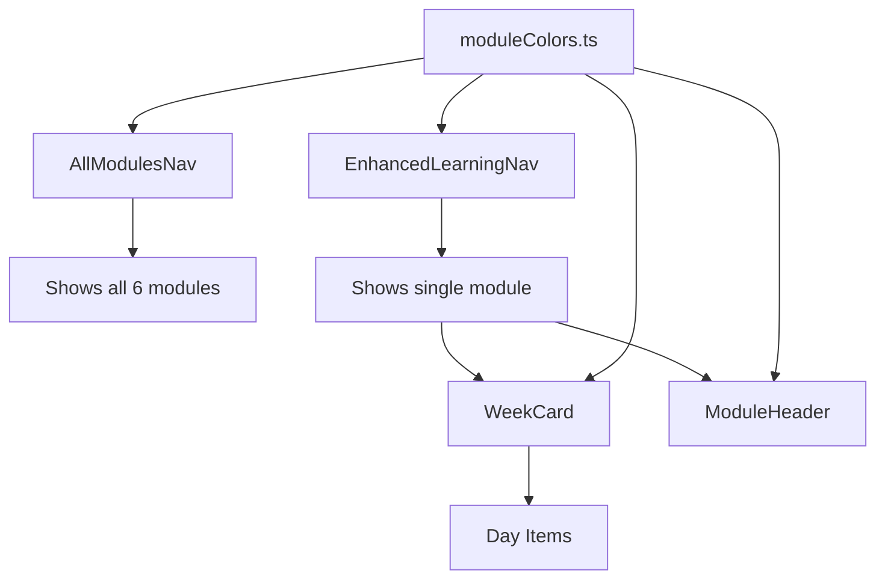

# Navigation Implementation Documentation

## 🎯 Overview

This document provides comprehensive documentation for the Blox Buddy navigation system, specifically focusing on the color-coded curriculum navigation that helps young developers (ages 10-25) easily understand their position within the 6-month learning journey.

**Last Updated**: August 26, 2025  
**Primary Components**: `AllModulesNav`, `EnhancedLearningNav`, `WeekCard`, `ModuleHeader`  
**Key Feature**: Color-coded module system for visual hierarchy

---

## 📋 Table of Contents

1. [Architecture Overview](#architecture-overview)
2. [Color Coding System](#color-coding-system)
3. [Component Structure](#component-structure)
4. [Implementation Details](#implementation-details)
5. [Adding New Features](#adding-new-features)
6. [Troubleshooting Guide](#troubleshooting-guide)
7. [Best Practices](#best-practices)

---

## 🏗️ Architecture Overview

### Navigation Hierarchy

```
📦 Modules (6 total - one per month)
 ┣ 📂 Week 1
 ┃ ┣ 📄 Day 1
 ┃ ┣ 📄 Day 2
 ┃ ┗ ...
 ┣ 📂 Week 2
 ┣ 📂 Week 3
 ┗ 📂 Week 4
```

### Component Dependencies



### File Structure

```
src/
├── components/
│   └── layout/
│       └── Sidebar/
│           ├── AllModulesNav.tsx      # Multi-module view
│           ├── EnhancedLearningNav.tsx # Single module view
│           ├── WeekCard.tsx           # Week component
│           └── ModuleHeader.tsx       # Module header
├── lib/
│   └── constants/
│       └── moduleColors.ts            # Color scheme constants
└── data/
    └── curriculum.json                 # Content structure
```

---

## 🎨 Color Coding System

### Module Color Assignments

Each module has a distinct color that flows through all its child components:

| Module | Color | Hex Code | Use Case |
|--------|-------|----------|----------|
| Module 1 | Green | `#10B981` | Foundation/Getting Started |
| Module 2 | Blue | `#3B82F6` | Core Concepts |
| Module 3 | Violet | `#A855F7` | Advanced Topics |
| Module 4 | Red | `#EF4444` | Challenges |
| Module 5 | Orange | `#F97316` | Projects |
| Module 6 | Yellow | `#FCD34D` | Mastery/Completion |

### Opacity Levels

The color system uses consistent opacity levels to create visual hierarchy:

```typescript
// Visual Hierarchy through Opacity (Updated 1.1.0)
Module Card:     20% opacity background, 30% border (50% on hover)
Week Card:       20% opacity background, 40% border (60% on hover)
Day Card:        15% opacity background, 30% border (50% on hover)
Video Card:      60% opacity background, standard border (80% on hover)

// Active States
Active Module:   Ring effect + stronger opacity
Active Week:     30% background opacity, 70% border with shadow
Active Day:      35% background opacity, 60% border with shadow
```

### Color Constants Structure

```typescript
// src/lib/constants/moduleColors.ts
export const moduleColorScheme = {
  // Module gradient backgrounds
  moduleGradients: [
    'from-blox-module-green/20 to-blox-module-green/5',   // Module 1
    'from-blox-module-blue/20 to-blox-module-blue/5',     // Module 2
    // ... etc
  ],
  
  // Module borders with hover states
  moduleBorders: [
    'border-blox-module-green/30 hover:border-blox-module-green/50',
    // ... etc
  ],
  
  // Week backgrounds, borders, text colors, etc.
  weekBackgrounds: [...],
  weekBorders: [...],
  dayBackgrounds: [...],
  // ... more arrays
}
```

---

## 🧩 Component Structure

### 1. AllModulesNav Component

**Purpose**: Displays all 6 modules in an expandable tree view  
**Location**: `src/components/layout/Sidebar/AllModulesNav.tsx`

#### Key Features:
- Shows all modules with progress indicators
- Expandable weeks and days
- Color-coded based on module
- Auto-expands active sections
- Saves expansion state to localStorage

#### Props Interface:
```typescript
interface AllModulesNavProps {
  currentModuleId?: string    // Currently active module
  currentWeekId?: string      // Currently active week
  currentDayId?: string       // Currently active day
}
```

#### Usage Example:
```tsx
<AllModulesNav 
  currentModuleId="module-1"
  currentWeekId="week-1"
  currentDayId="day-1"
/>
```

### 2. EnhancedLearningNav Component

**Purpose**: Shows a single module's content in detail  
**Location**: `src/components/layout/Sidebar/EnhancedLearningNav.tsx`

#### Key Features:
- Focused view of one module
- Detailed week/day navigation
- Progress tracking
- Passes color information to child components

#### Implementation Note:
```typescript
// Gets module index for color coding
const moduleIndex = curriculumData.modules.findIndex(m => m.id === activeModuleId)

// Passes to WeekCard
<WeekCard
  moduleIndex={moduleIndex >= 0 ? moduleIndex : 0}
  // ... other props
/>
```

### 3. WeekCard Component

**Purpose**: Displays a week's content with expandable days  
**Location**: `src/components/layout/Sidebar/WeekCard.tsx`

#### Key Features:
- Accepts `moduleIndex` prop for color inheritance
- Shows day completion indicators
- Expandable day list
- Progress percentage display

#### Critical Props:
```typescript
interface WeekCardProps {
  week: WeekData
  moduleIndex?: number  // For color coding (0-5)
  isExpanded: boolean
  isActive: boolean
  // ... other props
}
```

### 4. ModuleHeader Component

**Purpose**: Displays module overview with stats  
**Location**: `src/components/layout/Sidebar/ModuleHeader.tsx`

#### Features:
- Module title and description
- Progress bar with module color
- Stats grid (hours, XP, weeks, completion)
- Trophy icon for 100% completion

---

## 💻 Implementation Details

### Critical Implementation Rules

#### 1. **NO DYNAMIC TAILWIND CLASSES**

❌ **WRONG** - This will NOT work with Tailwind's purging:
```typescript
// Dynamic class generation - WILL FAIL
const color = `text-${moduleColors[index]}`
const bg = `bg-${moduleColors[index]}/20`
```

✅ **CORRECT** - Use explicit class arrays:
```typescript
// Explicit classes from constants
const textColors = [
  'text-blox-module-green',
  'text-blox-module-blue',
  // ... etc
]
const color = textColors[index]
```

#### 2. **Color Consistency**

Always use the module's color throughout its hierarchy:

```typescript
// In AllModulesNav.tsx
const moduleIndex = 0 // for Module 1

// Module card uses index
className={cn(moduleGradients[moduleIndex], moduleBorders[moduleIndex])}

// Week card uses same index
className={cn(weekBackgrounds[moduleIndex], weekBorders[moduleIndex])}

// Day card uses same index  
className={cn(dayBackgrounds[moduleIndex], dayBorders[moduleIndex])}
```

#### 3. **State Management**

Expansion states are preserved in localStorage:

```typescript
// Save expansion state
useEffect(() => {
  localStorage.setItem('all-modules-expanded', 
    JSON.stringify(Array.from(expandedModules)))
}, [expandedModules])

// Load on mount
useEffect(() => {
  const saved = localStorage.getItem('all-modules-expanded')
  if (saved) {
    setExpandedModules(new Set(JSON.parse(saved)))
  }
}, [])
```

### Adding Module Colors to Tailwind Config

The color definitions must exist in `tailwind.config.ts`:

```typescript
// tailwind.config.ts
colors: {
  'blox': {
    // ... existing colors
    'module-green': {
      light: '#6EE7B7',
      DEFAULT: '#10B981',
      dark: '#059669'
    },
    'module-blue': {
      light: '#60A5FA',
      DEFAULT: '#3B82F6',
      dark: '#2563EB'
    },
    // ... other module colors
  }
}
```

---

## 🎯 Viewport Color Integration (v1.1.0)

### Overview
The module color system now extends beyond the navigation sidebar into the main viewport, creating a cohesive visual experience throughout the learning journey.

### Affected Components

1. **ModuleOverview.tsx**
   - Week cards use module-specific backgrounds and borders
   - Day pills display module colors for incomplete days
   - Completed days show success green, in-progress show warning yellow

2. **WeekOverview.tsx**
   - Week cards have module-colored backgrounds
   - Expandable day list uses module colors
   - Day number boxes reflect module theme

3. **WeekPreview.tsx**
   - Day cards use module colors with proper opacity
   - Video cards maintain contrast against colored backgrounds

### Visibility Improvements

To address contrast and readability issues:

1. **Removed Glass Blur Effect**
   - Sidebar no longer uses `glass-blur` class
   - Changed from translucent (95% opacity) to solid background
   - Prevents haziness in viewport content

2. **Enhanced Video Card Contrast**
   ```typescript
   // Old: Low contrast
   bg-blox-second-dark-blue/30 hover:bg-blox-second-dark-blue/50
   
   // New: High contrast
   bg-blox-second-dark-blue/60 hover:bg-blox-second-dark-blue/80
   ```

3. **Stronger Visual Definition**
   - Video cards use `border-2` instead of `border`
   - Added `shadow-md hover:shadow-lg` for depth
   - Border opacity increased from 30% to 50% on hover

## ➕ Adding New Features

### Adding a New Module (Module 7+)

1. **Update Color Constants** (`moduleColors.ts`):
```typescript
// Add to each array in moduleColorScheme
moduleGradients: [
  // ... existing 6 modules
  'from-blox-module-cyan/20 to-blox-module-cyan/5', // Module 7
],
moduleBorders: [
  // ... existing 6 modules
  'border-blox-module-cyan/30 hover:border-blox-module-cyan/50',
],
// ... update all other arrays
```

2. **Add Tailwind Color** (`tailwind.config.ts`):
```typescript
'module-cyan': {
  light: '#67E8F9',
  DEFAULT: '#06B6D4',
  dark: '#0891B2'
}
```

3. **Update Curriculum Data** (`curriculum.json`):
```json
{
  "modules": [
    // ... existing modules
    {
      "id": "module-7",
      "title": "New Module Title",
      "weeks": [...]
    }
  ]
}
```

### Adding Custom Styling to Specific Modules

If you need module-specific styling beyond colors:

```typescript
// In your component
const getModuleSpecificClass = (moduleIndex: number) => {
  switch(moduleIndex) {
    case 0: return 'animate-pulse-slow' // Special animation for Module 1
    case 5: return 'ring-2 ring-yellow-400' // Celebration ring for final module
    default: return ''
  }
}

// Usage
<div className={cn(
  baseClasses,
  getModuleSpecificClass(moduleIndex)
)}>
```

---

## 🐛 Troubleshooting Guide

### Common Issues and Solutions

#### Issue 1: Colors Not Showing
**Symptom**: Module colors appear as gray or default colors  
**Cause**: Dynamic class generation or missing Tailwind classes  
**Solution**:
1. Check that you're using explicit classes from `moduleColors.ts`
2. Verify the color exists in `tailwind.config.ts`
3. Restart dev server after adding new colors

#### Issue 2: Wrong Module Color Applied
**Symptom**: Week/day shows wrong module's color  
**Cause**: Incorrect `moduleIndex` passed to component  
**Solution**:
```typescript
// Ensure correct index calculation
const moduleIndex = curriculumData.modules.findIndex(
  m => m.id === activeModuleId
)
// Pass to child components
<WeekCard moduleIndex={moduleIndex >= 0 ? moduleIndex : 0} />
```

#### Issue 3: Hover Effects Not Working
**Symptom**: No visual feedback on hover  
**Cause**: Missing hover classes or CSS conflicts  
**Solution**:
1. Ensure hover classes are included in the arrays
2. Check for conflicting CSS that might override hover states
3. Verify Tailwind's hover variant is enabled

#### Issue 4: Performance Issues with Many Modules
**Symptom**: Slow rendering with expanded modules  
**Solution**:
```typescript
// Use React.memo for expensive components
const WeekCard = React.memo(({ ... }) => {
  // component logic
})

// Implement virtualization for very long lists
import { FixedSizeList } from 'react-window'
```

---

## ✅ Best Practices

### 1. Component Organization

- Keep color logic centralized in `moduleColors.ts`
- Pass `moduleIndex` through component hierarchy
- Use TypeScript for type safety

### 2. Performance Optimization

```typescript
// Memoize expensive calculations
const moduleStats = useMemo(() => {
  return module.weeks.reduce((acc, week) => {
    // ... calculations
  }, initialValue)
}, [module.weeks])

// Use callback refs for event handlers
const handleClick = useCallback((moduleId: string) => {
  router.push(`/learning/${moduleId}`)
}, [router])
```

### 3. Accessibility

```typescript
// Add ARIA labels
<button
  aria-label={`Expand ${module.title}`}
  aria-expanded={isExpanded}
  onClick={toggleExpansion}
>

// Include keyboard navigation
onKeyDown={(e) => {
  if (e.key === 'Enter' || e.key === ' ') {
    handleClick()
  }
}}
```

### 4. Testing Considerations

```typescript
// Test color application
describe('Module Colors', () => {
  it('applies correct color to module 1', () => {
    const { container } = render(
      <AllModulesNav currentModuleId="module-1" />
    )
    expect(container.querySelector('.from-blox-module-green')).toBeTruthy()
  })
})
```

### 5. Code Comments

Always comment on WHY, not WHAT:

```typescript
// ❌ BAD: Sets the module index
const moduleIndex = 0

// ✅ GOOD: Default to first module's colors when module not found
const moduleIndex = modules.findIndex(m => m.id === id) || 0
```

---

## 📚 Additional Resources

- [Tailwind CSS Documentation](https://tailwindcss.com/docs)
- [Framer Motion Docs](https://www.framer.com/motion/)
- [React Performance Guide](https://react.dev/learn/render-and-commit)

---

## 👥 Maintenance Team

For questions or updates to this documentation:
- **Primary**: Navigation Team
- **Last Updated By**: Senior Engineer
- **Review Schedule**: Monthly

---

## 🔄 Version History

| Version | Date | Changes |
|---------|------|---------|
| 1.0.0 | Aug 26, 2025 | Initial color coding implementation |
| 1.0.1 | Aug 26, 2025 | Added explicit class arrays to fix Tailwind purging |
| 1.1.0 | Aug 26, 2025 | Extended color coding to viewport day cards and improved visibility |
| 1.2.0 | Aug 31, 2025 | Identified critical navigation issues and documented fix plan |

---

## 🚨 CRITICAL ISSUES TO FIX (v1.2.0 - Aug 31, 2025)

### Current Problems:
1. **Only Module 1 Shows in Navigation**: When on a learning page, sidebar only displays the current module instead of all 6 modules
2. **Missing Viewport Color Scheme**: Learning components (ModuleOverview, WeekPreview, DayView) use hardcoded teal colors instead of module-specific colors
3. **Dynamic Class Interpolation Breaking**: WeekCard line 201 uses dynamic string interpolation that breaks Tailwind's purging

### Root Causes:
1. **SidebarNav.tsx line 96**: Changed from `showAllModules={true}` to `showAllModules={!isLearningPath}` 
   - This makes it show focused view (single module) when ON a learning page
   - Should be `showAllModules={true}` to always show all modules

2. **WeekCard.tsx line 201**: Dynamic class generation doesn't work with Tailwind
   ```typescript
   // BROKEN:
   `border border-${textColors[moduleIndex].replace('text-', '')}/50`
   ```

3. **Missing Color Integration in Viewport Components**:
   - ModuleOverview.tsx: Uses hardcoded `bg-blox-teal`, `border-blox-teal`, etc.
   - WeekPreview.tsx: No moduleColorScheme import
   - DayView.tsx: No module-specific colors

### Fix Implementation Plan:

#### 1. Restore All Modules in Navigation
```typescript
// SidebarNav.tsx line 96
// Change from:
showAllModules={!isLearningPath}
// To:
showAllModules={true}
```

#### 2. Fix Dynamic Classes in WeekCard
```typescript
// Option A: Use style prop for dynamic colors
style={{ borderColor: `${moduleColors[moduleIndex]}50` }}

// Option B: Create explicit mapping
const borderColors = {
  0: 'border-blox-module-green/50',
  1: 'border-blox-module-blue/50',
  // etc...
}
```

#### 3. Add Color Scheme to Viewport Components

**ModuleOverview.tsx**:
```typescript
import { moduleColorScheme } from '@/lib/constants/moduleColors'

// Calculate moduleIndex
const moduleNumber = parseInt(module.id.split('-')[1], 10) || 1
const moduleIndex = moduleNumber - 1

// Apply colors
className={cn(
  moduleColorScheme.moduleGradients[moduleIndex],
  moduleColorScheme.moduleBorders[moduleIndex]
)}
```

**WeekPreview.tsx & DayView.tsx**: Similar implementation

### Files Requiring Updates:
1. `src/components/layout/Sidebar/SidebarNav.tsx` - Line 96
2. `src/components/layout/Sidebar/WeekCard.tsx` - Line 201
3. `src/components/learning/ModuleOverview.tsx` - Multiple lines
4. `src/components/learning/WeekPreview.tsx` - Add color scheme
5. `src/components/learning/DayView.tsx` - Add color scheme

### Expected Results After Fix:
- All 6 modules visible in sidebar navigation at all times
- Module-specific colors throughout viewport (green for Module 1, blue for Module 2, etc.)
- Consistent color scheme between sidebar and main content area
- Proper Tailwind class compilation without dynamic generation

---

**Remember**: The navigation system is the primary way young developers orient themselves in the platform. Always prioritize clarity, consistency, and visual feedback when making changes.